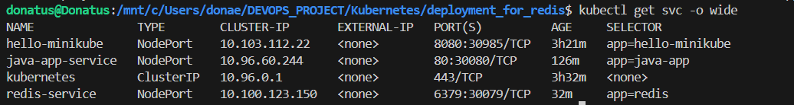

# Kubernetes Redis Lab

This project demonstrates deploying a single-node Redis instance on a Kubernetes cluster (Minikube).  

## Project Structure

k8s-redis-lab/

├── images/

│ ├── redis-deployment.png

│ ├── redis-service.png

│ └── redis-pong.png

├── redis-deployment.yaml

├── redis-service.yaml

└── README.md

---

## Steps Performed

1. **I Created a Deployment**

   - Defined a Deployment `redis-deployment.yaml` with a single Redis Pod.

   - I  Used `redis:6.2` image and exposed container port `6379`.

   

2. **I also Created Service**
   - Defined a Service `redis-service.yaml` using `NodePort` to allow external access.

   - Set `nodePort: 30079` (adjustable).

   

3. **I Deployed to Kubernetes**

   kubectl apply -f redis-deployment.yaml

   kubectl apply -f redis-service.yaml

## Verify Deployment

- kubectl get deployments

- kubectl get pods

- kubectl get svc

## Test Redis Connectivity

Inside cluster:

- kubectl run test-client --rm -it --image=redis:6.2 -- bash

- redis-cli -h redis-service ping

Expected output: PONG

## From host machine (NodePort):

- redis-cli -h <Minikube-IP> -p 30079 ping

## Optional Cleanup

- kubectl delete -f redis-service.yaml

- kubectl delete -f redis-deployment.yaml

## Challenges & Solutions

## Pod not accessible externally

- I Configured NodePort Service and verified IP/port.

## Testing Redis connectivity from host

- I Used Minikube IP with redis-cli.

## Ephemeral Redis data

- Aware that data is lost on Pod restart; for production, PersistentVolume would be required.

## Skills Demonstrated

- Kubernetes Deployment & Service management

- NodePort configuration for external access

- Debugging with kubectl

- Hands-on Redis usage in a cloud-native workflow

## Notes

- This is a **single-node Redis setup**, intended for learning and testing.

- For production, consider using **StatefulSets** and **PersistentVolumes** for data durability.